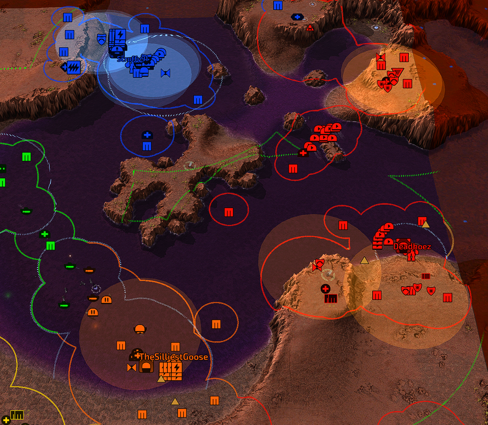
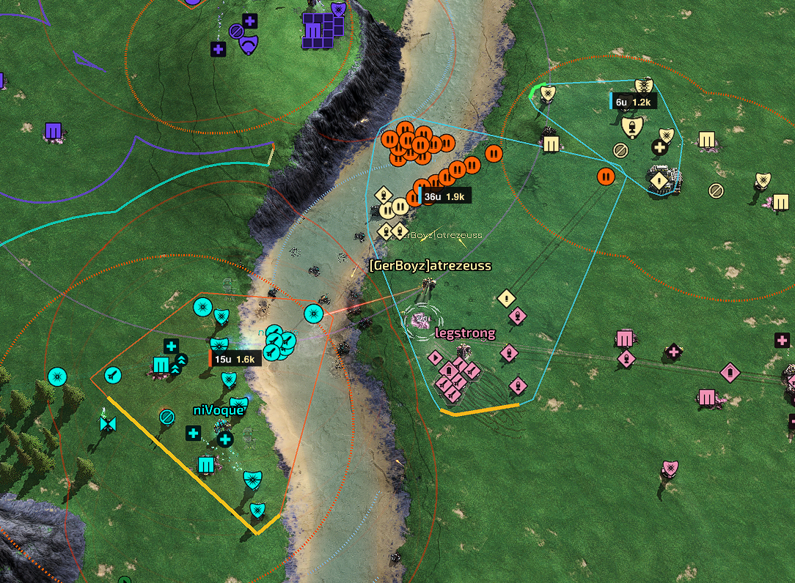
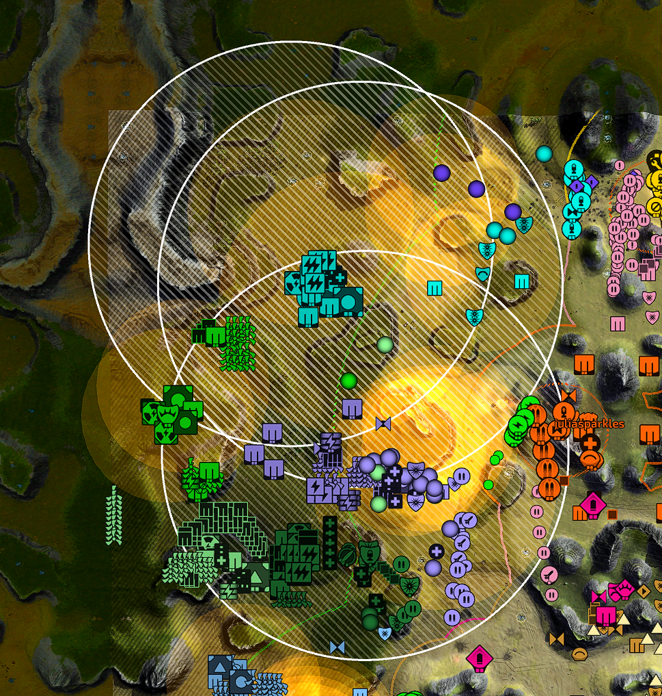

# AA Range

A widget that draws filled circles on the ground showing the engagement range of anti-air units. Enemy ranges are drawn in orange, allied ranges in blue.

## Screenshots

### Tactical group evaluation

### Anti-nuke coverage

Two render modes are available:

- **Overlap mode** (default) — additive blending, so overlapping circles brighten, giving a visual readout of AA coverage density.
- **Combine mode** — uses the stencil buffer to union overlapping circles. A pixel covered by one or ten circles renders at the same flat brightness, showing true coverage area instead of density. Requires stencil buffer support from the engine build.

Positions of previously sighted units are remembered, so ranges persist even after a unit has left — fading away once the spot is confirmed clear.

## Tactical group evaluation

The optional tactical overlay groups nearby ground combat units by their ability to support the same fight, then samples an attack from eight directions around each formation. Pairwise-connected formations are recursively split until every member is within its short-term combat reach of the group's geometric center, preventing chains of distant units from becoming one group. Groups smaller than five units are omitted because they are easy to assess directly. Cheap units remain eligible during the opening. They are suppressed only after three compact formations are active with at least four units costing 200 or more metal in each. The overlay deliberately does **not** treat the group's total value as power that is instantly available everywhere.

Each compact label shows the unit count and nominal combat score of the group. Hover the label for:

- nominal combat score of the whole group (DPS × durability, health-adjusted)
- power able to retaliate immediately at the weakest edge
- response-weighted power at that edge after five seconds

Analysis is rebuilt once per second.

**Controls**

| Action | Key | Chat command |
|---|---|---|
| Toggle enemy AA ranges | `Ctrl+D` | `/aarange` |
| Toggle allied AA ranges | `Ctrl+Shift+D` | `/aaally` |
| Toggle combine mode | `Ctrl+Alt+D` | `/aacombine` |
| Toggle tactical groups | `Ctrl+G` | `/aatactical` |
| Clear remembered positions | — | `/aaclear` |

On-screen buttons are also available for mouse control.
